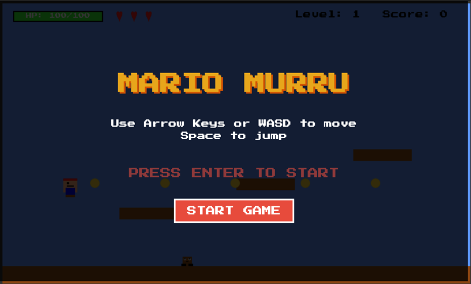

# Mario Murru Game

A simple 2D platformer game inspired by classic Mario Bros games, featuring a character named Mario Murru.

## Game Description

Mario Murru is a 2D platformer where you control the hero, Mario Murru, as he jumps on platforms, collects coins, and defeats enemies. The game features simple physics, collision detection, and sprite animations.

## Screenshots

## How to Play

1. Open `index.html` in a modern web browser
2. Use the arrow keys or WASD to move:
   - Left Arrow / A: Move left
   - Right Arrow / D: Move right
   - Up Arrow / W / Space: Jump
3. Jump on enemies to defeat them
4. Collect all the coins to win

## Game Features

- Character movement and jumping physics
- Platform collision detection
- Enemy AI with basic movement patterns
- Collectible coins
- Simple sprite animations

## Technical Details

The game is built using:
- HTML5 Canvas for rendering
- Vanilla JavaScript for game logic
- CSS for styling

## Credits

This game uses free assets from various sources. All game assets are used under free licenses or are placeholder graphics.

## Development

To modify or extend the game:

1. Clone the repository
2. Run `npm install` to install dependencies
3. Run `npm run dev` to start the development server
4. Edit `js/game.js` to change game mechanics
5. Replace placeholder images in `assets/images/` with your own sprites
6. Modify `index.html` to change the layout or styling

## Test 
To run tests:
1. Run `npm test`

## Eslint
To run eslint:
1. Run `npm run lint`

## Building for Production

To create an optimized production build:

1. Run `npm run build`
2. The optimized files will be generated in the `dist` folder

## License

This project is licensed under the MIT License - see the [LICENSE](LICENSE) file for details.